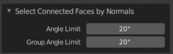

# Select Connected Faces by Normals - Blender Addon

## Installation
1. Right click [**this link**](https://raw.githubusercontent.com/japuzen/bpy-SelectFacesByNormals/master/Select_Faces_by_Normals_Addon.py) and click *Save Link As* to download the Python file.
2. In Blender, go to *Edit > Preferences*.

3. In *Addons* click *Install* and find the *Select_Faces_by_Normals_Addon.py* file.

4. Click the checkbox to the left of the addon to enable it.

## Usage
1. Select an object and go into Edit mode
2. Select one or multiple faces
3. Click the ***Select Connected Faces by Normals*** operator at the bottom of the ***Select*** dropdown menu. You can also use the *Search* function in Blender to find the operator (the default keybinding is F3).

4. A menu panel will pop up on the bottom left corner of the 3D Viewport. You can use this to change the Angle Limit and Group Angle Limit.

